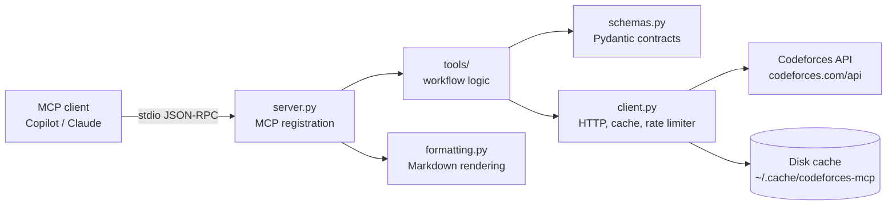

# Technical Overview

`codeforces-mcp` is a Python MCP server that exposes read-only Codeforces practice
workflows to coding agents. The server uses the Codeforces public API, transforms
upstream responses into typed Pydantic models, and returns Markdown or JSON through
MCP tools.

## Architecture



The process is started by the `codeforces-mcp` console script and communicates over
stdin/stdout using the MCP SDK's stdio transport. There is no web server, database,
or authentication service.

## Source Layout

| Module | Responsibility |
| --- | --- |
| `src/codeforces_mcp/server.py` | Declares MCP tools, validates flat arguments, handles errors, selects output format |
| `src/codeforces_mcp/tools/` | Implements Codeforces workflows without MCP imports |
| `src/codeforces_mcp/client.py` | Calls the API, unwraps response envelopes, applies cache and rate limiting |
| `src/codeforces_mcp/schemas.py` | Defines all input/output models, enums, validation, and epoch conversion |
| `src/codeforces_mcp/formatting.py` | Converts typed results to Markdown tables |
| `tests/contract/` | Deterministic fixture-backed tests for acceptance criteria |
| `tests/live/` | Opt-in tests that verify the live upstream shape |
| `eval/` | Natural-language practice cases and semantic assertions |
| `.claude/skills/cf-practice/` | Reusable guidance for agents choosing and sequencing practice actions |

## Request Lifecycle

1. An MCP client starts `codeforces-mcp` as a stdio subprocess.
2. The MCP SDK performs initialization and advertises the registered tools.
3. `server.py` receives a tool call with flat, individually described arguments.
4. The server constructs the corresponding Pydantic input model. Invalid arguments are
   returned as actionable validation text.
5. The tool module calls `CodeforcesClient` with only the upstream parameters it needs.
6. The client removes `None` parameters, checks the disk cache, waits for the request
   limiter when necessary, and calls `https://codeforces.com/api/{method}`.
7. The client validates the API envelope status and returns the unwrapped `result`.
8. The tool maps upstream dictionaries into typed Pydantic output models.
9. The server serializes the model as indented JSON or passes it to the Markdown
   formatter, then returns text in the MCP tool result.

## MCP Contract

The server registers six read-only tools. All tools advertise these annotations:

- `readOnlyHint: true`
- `destructiveHint: false`
- `idempotentHint: true`
- `openWorldHint: true`

Every tool supports `response_format` with `markdown` as the default and `json` as the
machine-readable alternative. Tool parameters stay flat so an MCP client sees each
argument's description and constraints directly in the generated schema.

The server supports the MCP SDK naming used by both supported SDK generations: it
prefers `MCPServer` and falls back to `FastMCP` when the newer import is unavailable.

## Tool Implementations

### Problem search

`codeforces_search_problems` loads `problemset.problems`, filters by an optional rating
range and tags, sorts by rating/contest/index, and applies pagination. When
`exclude_solved_by` is provided, it loads that handle's `user.status` and removes
problems with an `OK` verdict. A problem is identified by `(contestId, index)`.

Unknown tags are rejected with a message containing the known Codeforces tags. Unrated
problems are excluded whenever a rating bound is supplied.

### Tag performance

`codeforces_tag_performance` uses one `user.status` request. Codeforces embeds each
submission's problem tags inline, so no problemset join is necessary. Submissions are
collapsed by problem key before counting:

- attempted: one distinct problem with at least one submission
- solved: a distinct problem with at least one `OK` verdict
- solve rate: `solved / attempted`
- average and maximum solved rating: calculated only from solved rated problems

Results are sorted by lowest solve rate first, with higher attempt counts breaking ties.
Tags below `min_attempted` are returned in `insufficient_data`.

### Submission history

`codeforces_recent_submissions` loads `user.status`, sorts by
`creationTimeSeconds` descending, optionally filters by normalized uppercase verdict,
and returns the newest requested window. Epoch timestamps are converted to ISO 8601
UTC strings, and each submission includes a Codeforces link.

### User and contest data

`codeforces_user_profile` maps `user.info` to a profile model while preserving `None`
for fields absent on unrated or partially populated accounts. `codeforces_rating_history`
maps `user.rating`, calculates rating deltas, sorts chronologically, and optionally
keeps only the newest contests. `codeforces_upcoming_contests` filters `contest.list`
to `BEFORE` contests, sorts by start time, and formats durations for agents.

## Upstream API Boundary

The client targets `https://codeforces.com/api/` and handles the standard envelope:

```json
{"status": "OK", "result": {}}
{"status": "FAILED", "comment": "User with handle xyz not found"}
```

A failed envelope raises `CodeforcesError`, preserving the upstream `comment` and API
method. The server turns that into an actionable tool response. Non-JSON responses are
also converted into a client error after the HTTP status is checked.

Current upstream methods used by the tools:

| API method | Used by |
| --- | --- |
| `problemset.problems` | problem search |
| `user.status` | problem exclusion, tag performance, recent submissions |
| `user.info` | user profile |
| `user.rating` | rating history |
| `contest.list` | upcoming contests |

## Caching and Rate Limiting

The process-wide client shares one disk cache and one asynchronous rate limiter across
all tools. Cache keys are SHA-256 hashes of the method and sorted parameters. Writes
use a temporary file followed by an atomic replace, and corrupt entries become cache
misses rather than failures.

| API method | Cache TTL |
| --- | ---: |
| `problemset.problems` | 6 hours |
| `contest.list` | 1 hour |
| `user.info` | 1 hour |
| `user.rating` | 15 minutes |
| `user.status` | 5 minutes |

The limiter spaces consecutive upstream requests by approximately two seconds, in line
with Codeforces guidance. All cache reads and writes explicitly use UTF-8.

## Type and Validation Boundaries

Input models use Pydantic with whitespace stripping, assignment validation, and
`extra="forbid"`. Important constraints include:

- ratings between 800 and 3500
- at most 10 search tags
- search result limits between 1 and 100
- contest result limits between 1 and 50
- handles between 1 and 24 characters
- `min_rating <= max_rating` when both are supplied
- tag and verdict normalization before workflow logic

Output models are always returned from tool modules. Raw upstream dictionaries do not
cross the tool boundary, so an upstream shape change produces a validation failure
instead of silently malformed agent output.

## Testing and Quality Gates

The project uses three complementary test layers:

```text
contract tests  -> offline behavior and acceptance criteria
live tests      -> opt-in upstream response shape
agent eval      -> tool arguments and semantic practice outcomes
```

Run the local checks with:

```bash
ruff check .
mypy src/
pytest tests/contract -q
python eval/run_eval.py
```

Live API checks are opt-in:

```bash
pytest -m live -q
```

Contract tests use recorded fixtures and do not require network access. Fixture refreshes
are performed by `tests/record_fixtures.py` and should be reviewed because upstream
problem data can change.

## Adding a Tool

1. Define input and output models in `schemas.py`.
2. Add MCP-independent workflow logic under `tools/`.
3. Register a flat-parameter wrapper in `server.py`.
4. Add Markdown rendering in `formatting.py` when the result needs a table.
5. Add fixture-backed contract tests and acceptance criteria to `SPEC.md`.
6. Add or update an eval case when the tool changes agent-facing behavior.
7. Run the complete local quality checks before submitting the change.

Keep MCP imports in `server.py` only. Keep upstream response parsing and business
logic out of the MCP registration layer.

## Known Design Limits

- The Codeforces API is public and rate limited; availability and response shape are
  external dependencies.
- Tag performance measures solve rate on attempted problems. It does not correct for
  users selecting problems they already expect to solve.
- Agent evaluation currently names the expected tool instead of testing model-based
  tool selection.
